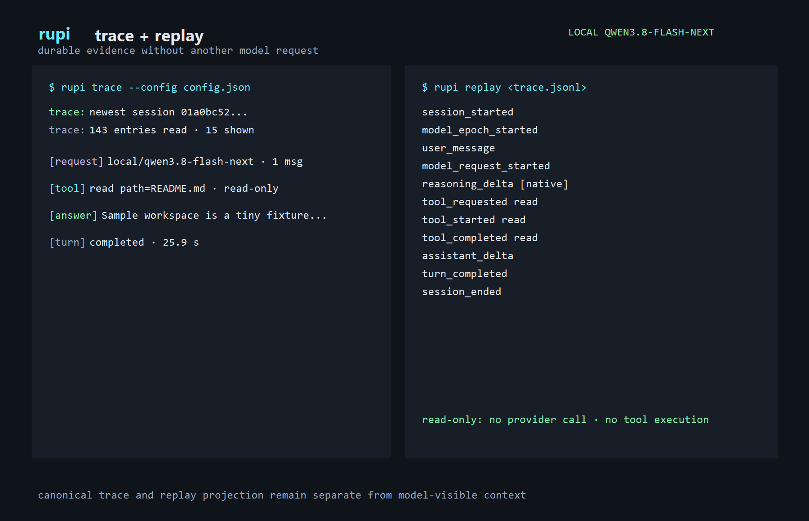

# rupi

<p align="center">
  <strong>A small, observable coding harness for local and remote models.</strong>
</p>

<p align="center">
  <a href="https://github.com/SaehwanPark/rupi/actions/workflows/ci.yml"></a>
  <a href="https://saehwanpark.github.io/rupi/"></a>
  <a href="https://github.com/SaehwanPark/rupi/releases"></a>
  <a href="https://www.rust-lang.org"></a>
  <a href="LICENSE"></a>
</p>

---

> **Minimal core. Observable execution. Honest provenance. Recoverable state.**

**rupi is not a Pi rewrite or Rust port.** It is an independent coding harness that
keeps a small terminal workflow while offering behavioral compatibility with selected Pi
skills, prompts, packages, extensions, and session files.

The current release is **v0.2.2**. The easiest first model is a local
[llama.cpp](https://github.com/ggml-org/llama.cpp) server running
Qwen3.8-Flash-Next; cloud OpenAI-compatible endpoints work too.

## What rupi does

- **Runs in a terminal:** use `rupi run` for scripts or `rupi interactive` for a
  multi-turn session.
- **Uses your model:** connect to a local or remote OpenAI-compatible endpoint; no
  provider is contacted until you submit a turn.
- **Keeps you in control:** reads stay inside `--cwd`; writing and shell tools are
  disabled unless you explicitly enable them for a trusted workspace.
- **Preserves evidence:** sessions, tool outcomes, exposed reasoning provenance, and
  failover boundaries are recorded in `.rupi-state`.
- **Stays inspectable:** `rupi trace` reads a session and `rupi replay` examines history
  without contacting a model or re-running tools.

## Quick start

### 1. Install rupi

On Linux or macOS, the release installer downloads the matching archive, verifies its
SHA-256 checksum, and installs into `~/.local/bin`:

```bash
curl --proto '=https' --tlsv1.2 -fsSL https://raw.githubusercontent.com/SaehwanPark/rupi/main/install.sh | sh
export PATH="$HOME/.local/bin:$PATH"
```

Pin an exact release or choose another writable directory with:

```bash
curl --proto '=https' --tlsv1.2 -fsSL https://raw.githubusercontent.com/SaehwanPark/rupi/main/install.sh \
  | sh -s -- --version v0.2.2 --install-dir "$HOME/.local/bin"
```

On Windows PowerShell, download the script so you can inspect it, then run it for the
current user:

```powershell
Invoke-WebRequest https://raw.githubusercontent.com/SaehwanPark/rupi/main/install.ps1 -OutFile .\install-rupi.ps1
Get-Content .\install-rupi.ps1
.\install-rupi.ps1 -Version v0.2.2 -AddToPath
Remove-Item .\install-rupi.ps1
```

`-AddToPath` updates the user-level PATH and does not require administrator access. The
installers support Linux x86_64, macOS Intel/Apple Silicon, and Windows x86_64. If your
target is not published yet, use the source build:

```bash
git clone https://github.com/SaehwanPark/rupi.git
cd rupi
cargo install --path . --locked
```

Or download a matching binary from the
[GitHub Releases](https://github.com/SaehwanPark/rupi/releases) page.

### 2. Start a local model (optional)

The beginner guide contains the complete PowerShell command for the supplied
Qwen3.8-Flash-Next llama.cpp setup. The important endpoint is:

```text
http://127.0.0.1:8000/v1
model: qwen3.8-flash-next
```

### 3. Create `config.json`

```json
{
  "version": 1,
  "primary": "local/qwen3.8-flash-next",
  "thinking": "xhigh",
  "state_dir": ".rupi-state",
  "endpoints": [
    {
      "provider": "local",
      "model": "qwen3.8-flash-next",
      "base_url": "http://127.0.0.1:8000/v1",
      "capabilities": {
        "text": true,
        "images": false,
        "tools": true,
        "exposed_reasoning": "native",
        "context_window": 262144
      }
    }
  ],
  "tools": {
    "auto_approve_mutating": false,
    "shell_timeout_ms": 120000,
    "max_output_bytes": 8192
  }
}
```

### 4. Ask a read-only question

```bash
rupi run --config config.json --cwd . \
  --prompt "List the top-level files and explain what this project is. Do not change files."
```

Assistant text goes to `stdout`; the labelled transcript and diagnostics go to `stderr`.
By default rupi refuses `write`, `edit`, and `exec`. Only set
`auto_approve_mutating` to `true` in a workspace you trust.

### 5. Continue or inspect the session

```bash
rupi interactive --config config.json --cwd .
rupi trace --config config.json <session-id>
rupi replay .rupi-state/sessions/<session-id>.trace.jsonl
```

If the model server is unavailable, check that it is listening on port 8000 and that the
configured model name exactly matches its `/v1/models` response. See the
[beginner guide](https://saehwanpark.github.io/rupi/getting-started/quickstart.html) for
step-by-step recovery help.

## Live example: Test Ledger

The repository includes **Test Ledger**, a small dependency-free Python task ledger used
as a concrete first project. Run its independent tests, then ask rupi for a narrow
read-only review from the example directory:

```bash
cd docs/cases/2026-09-20-task-ledger/toy-project
python -m unittest discover -s tests -p "test_*.py" -v
rupi run --config rupi.config.json --cwd . \
  --prompt "Read SPEC.md and the project files. Do not change anything. Summarize the contract and the tests that prove it."
```

The checked-in example config is intended for this disposable workspace and allows
mutations; set `auto_approve_mutating` to `false` before a read-only first run elsewhere.
The [Test Ledger walkthrough](https://saehwanpark.github.io/rupi/getting-started/test-ledger.html)
shows the full test, trace, replay, and bounded-edit workflow.

## Live example: Read Queue

[Read Queue](https://saehwanpark.github.io/rupi/getting-started/read-queue.html) is a
second dependency-free Python example: a small HTTP/SQLite service with a
fresh-process restart oracle. Verify it independently, then ask rupi for a bounded
review from its project directory:

```bash
cd docs/cases/2026-09-20-reading-queue/project
python -W error::ResourceWarning -m unittest discover -s tests -p "test_*.py" -v
rupi run --config rupi.recovery.config.json --cwd . \
  --prompt "Inspect SPEC.md and the project. Run the project tests in a bounded slice and report exact results; do not edit files or run the independent oracle."
```

Run the independent HTTP/restart check from
`docs/cases/2026-09-20-reading-queue` afterward. The
[Read Queue walkthrough](https://saehwanpark.github.io/rupi/getting-started/read-queue.html)
covers Windows direct-argv verification, bounded turns, trace, and replay.

## Live example: Event Outbox

[Event Outbox](https://saehwanpark.github.io/rupi/getting-started/event-outbox.html)
is a third dependency-free Python example: a durable HTTP/SQLite outbox with
idempotent admission, retryable delivery, and a separate direct-argv sink
worker. Verify both the project suite and its independent fresh-process oracle:

```bash
cd docs/cases/2026-09-20-event-outbox/project
python -W error::ResourceWarning -m unittest discover -s tests -p "test_*.py" -v
cd ..
python -W error::ResourceWarning -m unittest discover -s acceptance -p "test_*.py" -v
```

The [Event Outbox walkthrough](https://saehwanpark.github.io/rupi/getting-started/event-outbox.html)
covers restart recovery, sink failures, retry state, and bounded trace/replay
evidence.

## Live example: Webhook Inbox

[Webhook Inbox](https://saehwanpark.github.io/rupi/getting-started/webhook-inbox.html)
is a fourth dependency-free Python example: an HMAC-authenticated HTTP/SQLite
inbox with expiring delivery leases, crash reclaim, and a direct-argv sink
worker. Verify both the project suite and its independent fresh-process oracle:

```bash
cd docs/cases/2026-09-20-webhook-inbox/project
python -W error::ResourceWarning -m unittest discover -s tests -p "test_*.py" -v
cd ..
python -W error::ResourceWarning -m unittest discover -s acceptance -p "test_*.py" -v
```

The [Webhook Inbox walkthrough](https://saehwanpark.github.io/rupi/getting-started/webhook-inbox.html)
covers exact-byte HMAC admission, idempotency, lease expiry, worker reclaim,
and bounded trace/replay evidence. The checked-in implementation passes; the
case reports separately record that the final local-model implementation
attempt remained incomplete.

## Live example: Batch Relay

[Batch Relay](https://saehwanpark.github.io/rupi/getting-started/batch-relay.html)
is a fifth dependency-free Python example: an authenticated HTTP/SQLite batch
worker with atomic dependency DAGs, retryable and terminal failures, blocked
dependents, leases, and a direct-argv sink. Verify both the project suite and
its independent fresh-process oracle:

```bash
cd docs/cases/2026-09-20-batch-relay/project
python -W error::ResourceWarning -m unittest discover -s tests -p "test_*.py" -v
cd ..
python -W error::ResourceWarning -m unittest discover -s acceptance -p "test_*.py" -v
```

The [Batch Relay walkthrough](https://saehwanpark.github.io/rupi/getting-started/batch-relay.html)
covers dependency ordering, retry/blocked state, lease reclaim, and bounded
trace/replay evidence. The checked-in implementation passes after bounded
tester repair; the case reports do not claim model-authored completion.

## Live example: Artifact Pipeline

[Artifact Pipeline](https://saehwanpark.github.io/rupi/getting-started/artifact-pipeline.html)
is a sixth dependency-free Python example: an authenticated HTTP/SQLite
pipeline worker that propagates explicitly declared JSON output fields into
downstream jobs. Verify its project suite and independent fresh-process oracle:

```bash
cd docs/cases/2026-09-20-artifact-pipeline/project
python -W error::ResourceWarning -m unittest discover -s tests -p "test_*.py" -v
cd ..
python -W error::ResourceWarning -m unittest discover -s acceptance -p "test_*.py" -v
```

The [Artifact Pipeline walkthrough](https://saehwanpark.github.io/rupi/getting-started/artifact-pipeline.html)
covers declared data flow, output persistence, retry/blocked state, lease
reclaim, and bounded trace/replay evidence. The checked-in fixture passes
after tester repair; the case reports do not claim model-authored completion.

## Commands

| Command | Purpose |
| :--- | :--- |
| `rupi run` | One durable, scriptable turn |
| `rupi interactive` | Multi-turn terminal session |
| `rupi trace` | Read the canonical event transcript |
| `rupi replay` | Inspect history without generation or tool execution |
| `rupi skills`, `prompts`, `packages` | Discover Pi-compatible artifacts |
| `rupi compat` | Report compatibility by surface |
| `rupi import-pi`, `export` | Move sessions to and from Pi JSONL |
| `rupi trust` | Record explicit project trust decisions |

Run `rupi <command> --help` for flags and examples.

## Screenshots

The public guide includes screenshots built from transcript and output captured from the real
local Qwen3.8-Flash-Next endpoint:




## Documentation and design

- **[Beginner guide](https://saehwanpark.github.io/rupi/)** — install, connect a model,
  make a safe first request, and recover from common setup errors.
- **[Architecture](ARCHITECTURE.md)** — runtime boundaries and invariants.
- **[Compatibility](COMPATIBILITY.md)** — measured upstream Pi behavior.
- **[Contributing](CONTRIBUTING.md)** — focused changes and verification commands.
- **[Roadmap](ROADMAP.md)** — current project state.

## License

`rupi` is distributed under the [MIT License](LICENSE).
