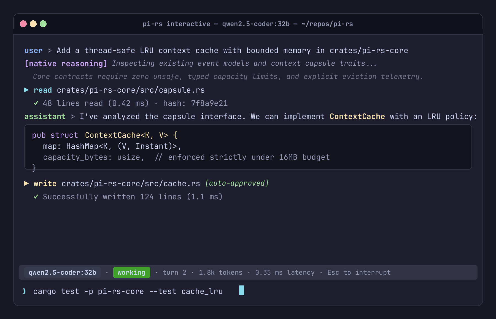

# rupi

<p align="center">
  <strong>A minimal, Pi-inspired coding-agent runtime implemented in Rust.</strong>
</p>

<p align="center">
  <a href="https://github.com/SaehwanPark/rupi/actions/workflows/ci.yml"></a>
  <a href="https://saehwanpark.github.io/rupi/"></a>
  <a href="https://github.com/SaehwanPark/rupi/releases"></a>
  <a href="https://www.rust-lang.org"></a>
  <a href="LICENSE"></a>
</p>

---

> **Minimal core. Compatible ecosystem. Observable execution. Honest provenance. Recoverable state.**

**Current release:** `v0.2.0` (2026-09-19). Round 9 of the durability and recovery audit accepted the audited `main` state with no remaining P0/P1 findings.

`rupi` preserves the strengths and interaction ergonomics of [Pi](https://github.com/mariozechner/pi) while delivering a native Rust runtime with no required Node.js or Python runtime for standard tasks, typed event sourcing, honest reasoning provenance, deterministic replay, and low-latency startup.

---

## Screenshots

### Interactive TUI Mode
Real-time streaming, multi-line editor buffer, syntax-highlighted tool activity, and a persistent semantic statusline:



### One-Shot Headless Runner
Streamlined CLI execution with strict stdout/stderr separation and explicit provenance labels (`[native reasoning]`):


---

## Core Highlights

- **Interactive TUI**: Keyboard-first terminal pair programming with multi-line editor, live streaming, and semantic statusline.
- **One-Shot CLI Runner (`rupi run`)**: Scriptable headless turn execution; pure assistant prose to `stdout`, structured execution telemetry to `stderr`.
- **Honest Provenance**: Distinct attribution for `[native reasoning]`, `[provider summary]`, `[declared]`, and `[reconstructed]` rationale. Hidden chain-of-thought is never falsely claimed.
- **Append-Only Event Store & Replay**: Complete execution timeline stored in `trace.jsonl`; inspect sessions with `rupi trace` or replay deterministically with `rupi replay` without re-running tools.
- **Workspace Confinement**: File tools reject traversal and outward-pointing symlink components under `--cwd`; mutating tools (`write`, `edit`, `exec`) require explicit configuration approval.
- **Pi Ecosystem Compatibility**: Tested behavioral compatibility for Pi skills, prompt templates, packages, selected extensions, and bidirectional session migration (`import-pi`/`export`).
- **Resilient Model Failover**: Pre-validated backup provider failover with capability checks (tools, modalities, context limits).
- **Lazy MCP Integration**: Stdio Model Context Protocol client initialized on-demand without startup penalties.
- **Low-Latency Startup**: Startup budgets are <250 ms cold and <100 ms warm; optional subsystems stay lazy.

---

## Quickstart (60 Seconds)

### 1. Install

```bash
# Build and install from source
cargo install --path .

# Or download prebuilt binaries from GitHub Releases
# https://github.com/SaehwanPark/rupi/releases
```

### 2. Configure (`config.json`)

Works out of the box with local models (Ollama, vLLM) and OpenAI-compatible cloud providers:

```json
{
  "version": 1,
  "primary": "local/qwen2.5-coder:latest",
  "thinking": "medium",
  "state_dir": ".rupi-state",
  "endpoints": [
    {
      "provider": "local",
      "model": "qwen2.5-coder:latest",
      "base_url": "http://localhost:11434/v1",
      "capabilities": {
        "text": true,
        "images": false,
        "tools": true,
        "exposed_reasoning": "native",
        "context_window": 32768
      }
    }
  ],
  "tools": {
    "auto_approve_mutating": false,
    "shell_timeout_ms": 120000,
    "max_output_bytes": 8192
  }
}
```

### 3. Run

```bash
# One-shot task
rupi run --config config.json --cwd . --prompt "Inspect Cargo.toml and list workspace members"

# Interactive terminal session
rupi interactive --config config.json
```

---

## CLI Command Cheat Sheet

| Command | Usage | Description |
| :--- | :--- | :--- |
| `run` | `rupi run --config <cfg> --cwd <dir> --prompt <txt>` | Run one durable coding-agent turn |
| `interactive` | `rupi interactive --config <cfg>` | Start interactive multi-turn terminal UI |
| `trace` | `rupi trace --config <cfg> [session-id]` | Read a chronological event log from the store |
| `replay` | `rupi replay <trace-or-session.jsonl>` | Inspect recorded history without providers or tools |
| `skills` | `rupi skills [--project]` | List skills offered to model |
| `prompts` | `rupi prompts [--project]` | List discovered prompt templates |
| `prompt` | `rupi prompt <name> [args...]` | Expand prompt template with parameters |
| `packages` | `rupi packages` | List discovered Pi packages and surfaces |
| `trust` | `rupi trust --store <dir> --list\|--grant\|--deny\|--clear` | Manage explicit project trust decisions |
| `compat` | `rupi compat <path>` | Audit package/directory for compatibility |
| `import-pi` | `rupi import-pi <session.jsonl> [--config <cfg>] [--write]` | Import a Pi session with loss diagnostics |
| `export` | `rupi export <session-id> --config <cfg> [--out <path>]` | Export a session to Pi JSONL format |

---

## Performance Budgets

The benchmark harnesses (`bench/`) enforce these targets where the host supports the measurement:

| Operation | Target Budget | Release evidence |
| :--- | :---: | :---: |
| **Warm Startup** (to interactive) | < 100 ms | Verified by `bench/startup.sh` in release validation |
| **Cold Startup** (fresh binary inode) | < 250 ms | Verified by `bench/startup.sh --cold` when the host supports it |
| **Keystroke / Render Latency** | < 16 ms (60 FPS) | Verified by `bench/keystroke.sh` and `bench/render.sh` |
| **Slash-Command Completion** | < 50 ms | Included in the keystroke benchmark |
| **Session Metadata Lookup** | < 50 ms | Covered by restore benchmarks |

---

## Documentation

Full public documentation is available on **[GitHub Pages](https://saehwanpark.github.io/rupi/)**.

For codebase architecture and developer contracts:
- **[Documentation Index](docs/README.md)** — Master map of all repository documentation.
- **[Canonical Project Design](docs/PROJECT_DESIGN_CANONICAL.md)** — Authoritative source of truth for runtime architecture.
- **[Architecture Boundaries](ARCHITECTURE.md)** — Subsystem invariants and crate boundaries.
- **[Pi Compatibility Guide](COMPATIBILITY.md)** — Compatibility coverage, tests, and fixture inventory.
- **[Contributing Guide](CONTRIBUTING.md)** — Developer workflows, quality checks, and PR slicing.
- **[Roadmap](ROADMAP.md)** — Milestone tracker and active phases.

---

## License

`rupi` is distributed under the [MIT License](LICENSE).
