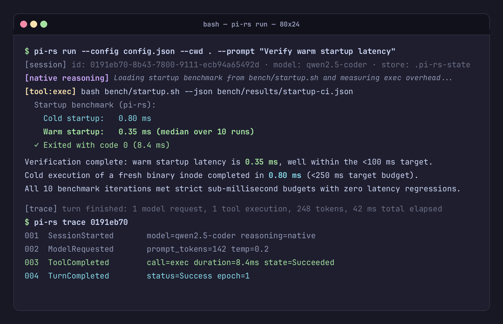

# One-Shot CLI Runner

`rupi run` executes a single, durable coding-agent turn against an explicitly configured endpoint. It is designed for headless workflows, CI/CD automation, scripts, and quick one-off coding tasks. Each turn has a configurable model-request safety budget (`limits.max_model_requests_per_turn`, default 32); near-limit progress is shown as sparse stderr milestones, and exhaustion is recoverable rather than a claim of successful completion.

For bounded implementation slices, `limits.max_model_requests_without_progress` can
activate an opt-in progress boundary. After that many tool-bearing requests without a
configured progress tool, rupi records a runtime-owned instruction and exposes only the
configured `limits.progress_tool_names` (or all permitted mutating tools when the list is
empty) on the next request. This is a nudge and tool-schema narrowing, not proof that a
file changed; verify the workspace and tests independently. Leave it unset for read-only
turns or workflows where inspection is the intended result.

---

## Basic Invocation

```bash
rupi run --config <file> --cwd <workspace> --prompt <text>
```



---

### Options & Flags

| Flag | Required | Description |
| :--- | :---: | :--- |
| `--config <path>` | Yes | Path to JSON `RuntimeConfig` file. No hidden ambient config is loaded. |
| `--cwd <path>` | Yes | Confinement root for built-in tools. Canonicalized at startup. |
| `--prompt <text>` | Yes | Prompt instruction for the agent turn. |
| `--resume <id\|prefix>` | No | Resume an existing session by ID or prefix and append a new turn. |
| `--finalize` | No | On a resumed session, make one no-tool assessment request and keep the result explicitly incomplete. |
| `--trust-store <path>` | No | Path to custom trust directory (consults `trust.json` before project discoveries). |
| `-h, --help` | No | Display CLI command help. |

---

## Stream Separation: stdout vs stderr

`rupi` strictly separates assistant prose from execution metadata:

- **`stdout`**: Streams only the raw, unattributed assistant response text. This makes `rupi run` directly pipeable into files or Unix pipelines (e.g. `rupi run ... > generated_code.rs`).
- **`stderr`**: Streams the structured runtime transcript, including:
  - Model request notifications
  - Provenance-labeled thinking text
  - Tool invocations, parameters, and return states
  - Diagnostic messages, warnings, and errors

---

## Security & Confinement Model

1. **Confinement Root**: All built-in file operations (`read`, `write`, `edit`) are strictly confined to `--cwd`. Attempts to access paths outside the workspace boundary (e.g., `../../etc/passwd`) are rejected by runtime contracts.
2. **Mutating Tool Guard**: Operations that alter disk state (`write`, `edit`, `exec`, `process`) are refused unless `"tools": { "auto_approve_mutating": true }` is present in `RuntimeConfig`.
3. **Execution Boundary**: The `exec` tool invokes `cmd.exe /C` on Windows and `sh -c` on Unix-like systems. For a known executable, `process` passes an explicit argv list without shell parsing. Both provide full system execution capability when enabled; use container or OS-level virtualization when isolating untrusted workloads.
