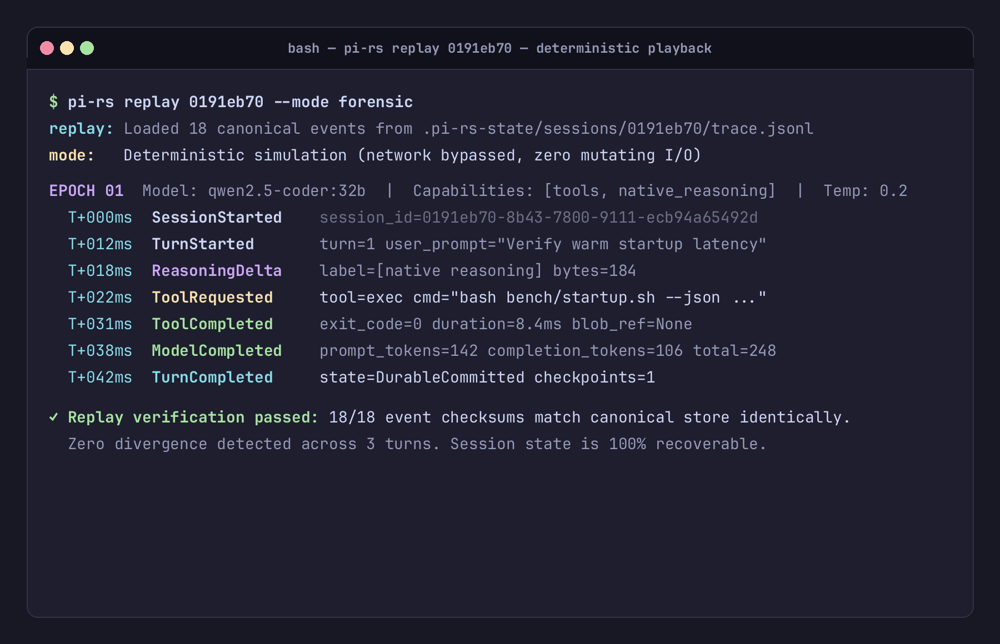

# Session Trace & Replay

A foundational principle of `pi-rs` is **honest observability**: every event that occurs during execution is recorded as an immutable, typed event in an append-only store.

---

## Canonical Trace Storage

Sessions are written under the configured `state_dir` (for example, `.pi-rs-state/`):

- **`sessions/<id>.jsonl`**: Semantic session messages used for resume.
- **`sessions/<id>.trace.jsonl`**: Append-only canonical `AgentEvent` journal.
- **`sessions/<id>.wal.jsonl`**: Crash-recovery projection intents; incomplete intents fail closed until repaired.
- **`sessions/<id>/blobs/`**: Content-addressed storage for large, redacted payloads.
- **`sessions/<id>/checkpoints/`**: Structured context capsules for reviewed reset/resume.

Unlike systems where session logs are reconstructed by summarizing chat history, `pi-rs` preserves the canonical runtime trace separately from model-visible context.

---

## Inspecting Traces (`pi-rs trace`)

View the chronological, formatted log of events for any session:

```bash
pi-rs trace --config config.json <session-id>
```

Output includes:
- Turn start and finish markers
- Model requests and latency measurements
- Thinking deltas with provenance tags
- Tool calls with formatted arguments and return status
- Compaction and failover events

---

## Deterministic Replay (`pi-rs replay`)

To inspect and verify past execution without making network calls or mutating disk files:

```bash
pi-rs replay .pi-rs-state/sessions/<session-id>.trace.jsonl
```



In replay mode:
- Events are loaded sequentially from `trace.jsonl`.
- The presentation layer renders the visual session identically to how it was experienced live.
- No network requests are sent to providers.
- No mutating tools (`write`, `edit`, `exec`) are re-executed.

---

## Resuming Sessions

To continue a previous conversation without losing conversational context:

```bash
pi-rs run --config config.json --cwd . --resume <session-id-or-prefix> --prompt "Refactor the function we just wrote"
```

The runtime resolves the session ID prefix, restores the latest durable projection and
checkpoint barrier when present, computes model-visible working context, and initiates
the next turn. Historical trace remains available without being injected wholesale into
the prompt.
